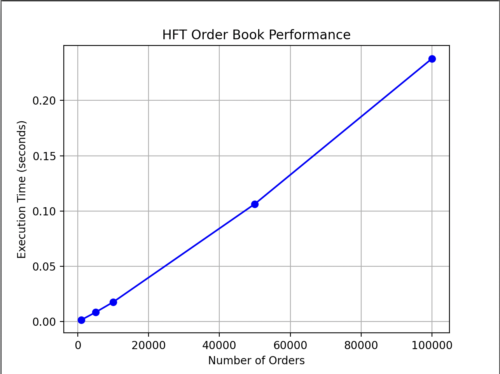

# HFT Order Book Performance Test

A simple high-frequency trading (HFT) order book benchmark written in **C++**, with performance visualization in **Python** using Matplotlib.

## Features
- Adds, modifies, and deletes orders efficiently using `std::map` and `std::unordered_map`.
- Includes stress tests and basic unit tests.
- Benchmarks order insertion speed at different scales.
- Generates a performance chart with Python.

## Build & Run

### 1. Compile and Run (C++)
```bash
g++ -O3 -std=c++17 orderbook.cpp -o orderbook
./orderbook
```
### 2. Visualize Results (Python)

``` bash
pip3 install matplotlib
python testing.py
```

### 3. Visualization Output (Hardcoded)
