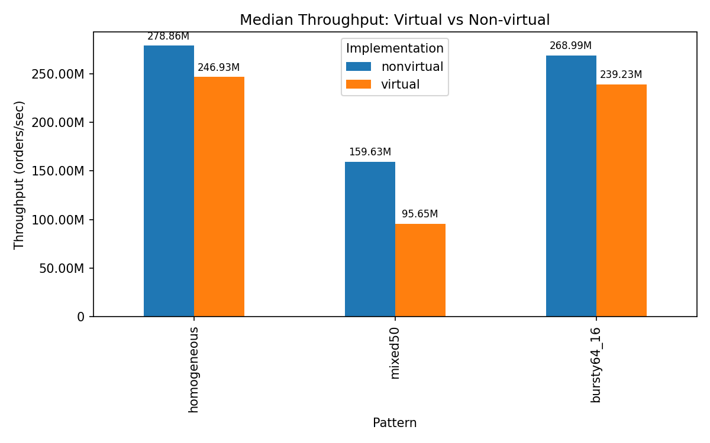

Build Instructions (macOS):
=
In your terminal type: 
-
clang++ -O3 -DNDEBUG -std=c++17 -Wall -Wextra -pedantic hft_assignment.cpp -o hft_bench

Then type: 
-
./hft_bench > out.csv

Results wil be found in a file called out.csv (whichever name you pipe ./hft_bench to).
-

Conclusion
=

For this project I used C++17, and benchmarked it on a 14" MacBook Pro with the Apple M1 Pro chip. I did the sampling on 
20,000,000 trades. The results table showed that for all types of runs (homogeneous, 50/50, and bursty), the non-virtual 
execution of trades was consistently faster. 

Homogenous runtime means that all the orders were sent to one method, 50/50 meant that each handling of order was randomly assigned between the two similar virtual or non-virtual methods, and bursty was 16 to one method, 64 to the other. This shows the destinction of when optimizations can be made with predictable runtime (homogenous) to in between (bursty) to when optimizations cannot be made (50/50). 

For my latest run, the median runtime for homogeneous + virtual was 81,215,167 ns 
(≈ 0.0812 s), while the median runtime for homogeneous + non-virtual was 71,809,459 ns (≈ 0.0718 s). 
The same trend holds across the other patterns: virtual dispatch is slower than non-virtual dispatch. 

This happens because virtual dispatch prevents the compiler from inlining function calls and requires an extra level of indirection through a vtable. That 
extra work has to happen at runtime, adding extra work. In contrast, the non-virtual path can be inlined and optimized more 
aggressively, which yields lower per-order latency and higher throughput.

On top of dispatch overhead, branch prediction and cache locality also play a role. The per-order work touches small 
fixed arrays (Book1, Book2, and counters) sized to fit in the L1 cache, so memory locality is good and consistent. The
mixed 50/50 pattern is harder for the CPU’s branch predictor, which reduces efficiency, while the bursty 64/16 pattern
makes prediction easier, letting both strategies run faster. These effects matter, but the main performance difference
still comes from the cost of virtual dispatch versus inlined non-virtual calls.

Median Throughput: Virtual vs Non-virtual visualization

 

